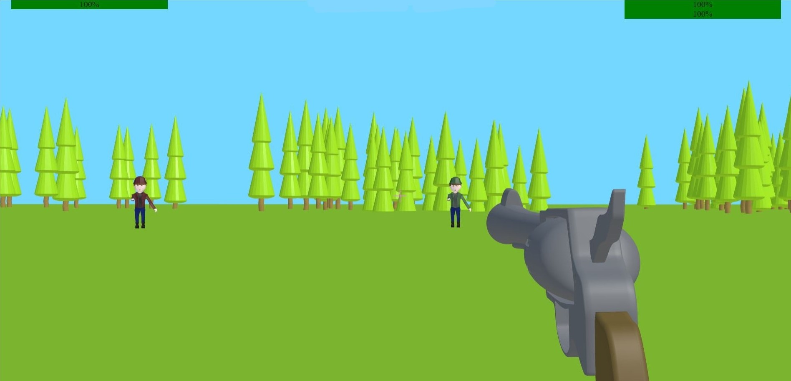
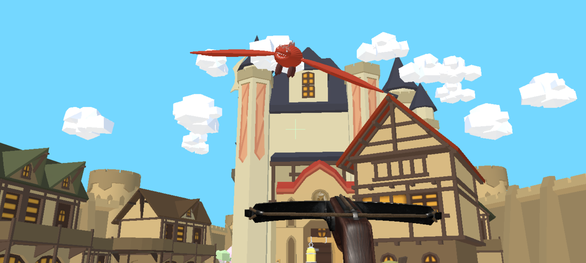

# The three kingdoms

## The project

**The three kingdoms** is the final project of Interactive Graphics course held by Prof. Marco Schaerf in La Sapienza, University of Rome. It is a first person shooter game where the user play as a character that needs to take back its throne in all of the three kingdoms.

## The kingdoms
Each kingdom is a level of the game (from the easiest to the hardest one).
For the first two levels, when the enemy is killed, you can proceed to the next kingdom using an archway that will be lightened by a spotlight.
At the start, you will choose if you want to fight by day or night and if you want to play as male or female.

### Desert
The desert is the first level of the game: this is an hostile environment where a cowboy shoots with its gun while it tries to protect himself behind some teepes (Native American tent).

### Nature
The nature is the second level of the game and can be seen as the level with medium difficulty. Here, there are two woodsmen that reclaim their land. You need to kill them in order to go to the next and last level.

### Castle
The castle is the third and last level of the game. It was a peaceful medieval town, until one day a dragon showed up. You need to put him down while it casts fireballs in your direction.
If you succeed, you will finally be the king/queen of the three kingdoms!

The game is developed using **threejs** library by [Irene Bondanza](irene,bondanza92@gmail.com), [Martina Valleriani](vallerianimartina@gmail.com) e [Pietro Nardelli](pietro.nardelli@outlook.com).

## How to play

- **W**, **A**, **S**, **D** to move the character around the map.
- **ESC** to check the key bindings.
- **X/RIGHT-CLICK** to shoot.

## Tips and suggestions
- We encourage you to play the game in Chrome browser to improve the gameplay.
- A good connection is suggested to reduce the loading time.
- Very rarely the character at the start may appears stuck in the sky. Don't worry, you just need to reload the page.
- Very few times an enemy may becomes hard to hit. If so just reload the page to restart the level.

## Play the Game
The game is accessible from this [link](https://sapienzainteractivegraphicscourse.github.io/final-project-mip-team/).
